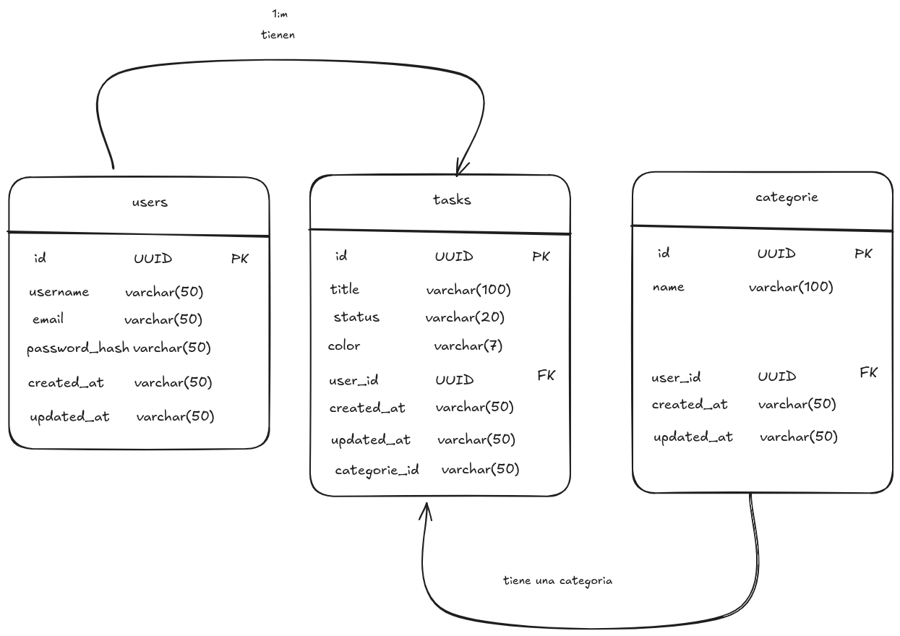
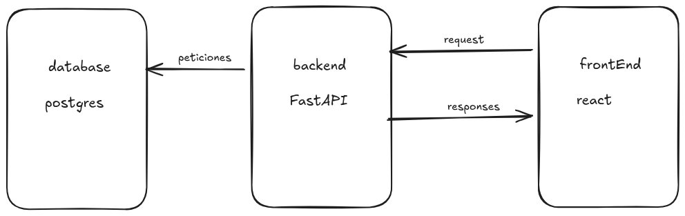

# Architecture Overview
This document provides an overview of the architecture of our system, detailing its main components, their interactions, and the overall design principles that guide its development.
The system is built using the following core technologies:
- FastAPI
- Docker
- PostgreSQL
## Folder Structure
The project follows a structured folder organization to maintain clarity and separation of concerns:
 - `app/`: Contains the main application code, including routes, models, and business logic.
    - `docs/`: Documentation files related to the project.
    - **api/**: Contains the FastAPI application code, including routes, models, and business logic.
    - **core/**: Contains core configurations and settings for the application.
    - **db/**: Database-related files, including migration scripts and seed data.
    - **models/**: Database models and schemas.
    - **repositories/**: Data access layer for interacting with the database.
    - **schemas/**: Pydantic schemas for request and response validation.

## Table relationships
The database schema is designed to efficiently manage tasks and users. The main tables include:
- **users**: Stores user information, including username, email, and hashed password.
- **tasks**: Stores task details, including title, description, status, and associated user
- **categories**: Stores task categories to organize tasks effectively.

## backend architecture
To ensure a scalable and maintainable backend architecture, the project is structured into several layers.

